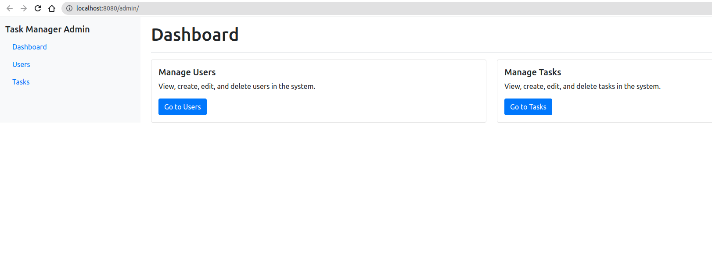

# Task Manager Application

A modern Task Management system built with Symfony 6.4, featuring both web admin panel and RESTful API endpoints. The application allows users to manage tasks and users with full CRUD operations.

## Features

- 🚀 **RESTful API** - Complete REST API for tasks and users
- 🎛️ **Admin Panel** - Web-based admin interface for managing tasks and users
- 📊 **Task Reports** - Command-line tool for task statistics
- 🧪 **Comprehensive Tests** - Unit tests for entities with PHPUnit
- 📖 **API Documentation** - Interactive Swagger/OpenAPI documentation
- 🐳 **Docker Ready** - Fully containerized with Docker Compose
- 💾 **MySQL Database** - Robust database with Doctrine ORM

## screenshots:
1: dashboard

2: user:

3: swagger:


## Table of Contents

- [Prerequisites](#prerequisites)
- [Installation](#installation)
- [Configuration](#configuration)
- [Running the Application](#running-the-application)
- [API Documentation](#api-documentation)
- [Available Endpoints](#available-endpoints)
- [Testing](#testing)
- [Console Commands](#console-commands)
- [Project Structure](#project-structure)
- [Development](#development)
- [Troubleshooting](#troubleshooting)

## Prerequisites

Before you begin, ensure you have the following installed on your system:

- [Docker](https://www.docker.com/get-started) (20.10 or later)
- [Docker Compose](https://docs.docker.com/compose/install/) (2.0 or later)
- [Git](https://git-scm.com/downloads)

## Installation

### 1. Clone the Repository

```bash
git clone <repository-url>
cd Task-Manager
```

### 2. Environment Configuration

Create your local environment file:

```bash
cp .env.dist .env
```

Edit `.env` and configure your MySQL credentials:

```env
# MySQL Configuration
MYSQL_DATABASE=task_manager
MYSQL_ROOT_PASSWORD=your_secure_password
```

### 3. Build and Start Docker Containers

```bash
docker-compose up -d --build
```

This command will:
- Build the PHP/Symfony application container
- Start MySQL 8.0 database
- Configure Nginx web server
- Set up networking between containers

### 4. Install Dependencies

```bash
docker-compose exec app composer install
```

### 5. Set Up Database

Create and migrate the database:

```bash
# Create the database
docker-compose exec app php bin/console doctrine:database:create

# Run migrations
docker-compose exec app php bin/console doctrine:migrations:migrate --no-interaction
```

## Configuration

### Database Configuration

The application uses MySQL 8.0 by default. Database configuration is handled through environment variables:

- `MYSQL_DATABASE`: Database name (default: task_manager)
- `MYSQL_ROOT_PASSWORD`: MySQL root password
- `DATABASE_URL`: Complete database connection string

### Application Settings

Key configuration files:
- `.env.dist`: Default environment variables
- `.env`: Local overrides (not committed)
- `.env.test`: Test environment configuration

## Running the Application

### Start the Application

```bash
docker-compose up -d
```

### Access Points

- **Web Application**: http://localhost:8080
- **Admin Panel**: http://localhost:8080/admin/
- **API Documentation**: http://localhost:8080/api/doc
- **API Endpoints**: http://localhost:8080/api/

### Stop the Application

```bash
docker-compose down
```

### View Logs

```bash
# All services
docker-compose logs -f

# Specific service
docker-compose logs -f app
docker-compose logs -f nginx
docker-compose logs -f db
```

## API Documentation

The application includes interactive API documentation powered by Nelmio API Doc Bundle.

### Access Documentation

- **Swagger UI**: http://localhost:8080/api/doc
- **JSON Format**: http://localhost:8080/api/doc.json

## Available Endpoints

### Task Management

| Method | Endpoint | Description |
|--------|----------|-------------|
| GET | `/api/tasks` | List all tasks |
| POST | `/api/tasks` | Create a new task |
| GET | `/api/tasks/{id}` | Get specific task |
| PUT | `/api/tasks/{id}` | Update task |
| DELETE | `/api/tasks/{task}` | Delete task |
| GET | `/api/tasks/user/{user}` | List tasks by user |
| PUT | `/api/tasks/{task}/status` | Update task status only |

### User Management

| Method | Endpoint | Description |
|--------|----------|-------------|
| GET | `/api/users` | List all users |
| POST | `/api/users` | Create a new user |
| GET | `/api/users/{id}` | Get specific user |
| PUT | `/api/users/{id}` | Update user |
| DELETE | `/api/users/{id}` | Delete user |

### Admin Panel Routes

| Route | Description |
|-------|-------------|
| `/admin/` | Admin dashboard |
| `/admin/tasks/` | Task management |
| `/admin/users/` | User management |

### Example API Requests

#### Create a User
```bash
curl -X POST http://localhost:8080/api/users \
  -H "Content-Type: application/json" \
  -d '{"name": "John Doe", "email": "john@example.com"}'
```

#### Create a Task
```bash
curl -X POST http://localhost:8080/api/tasks \
  -H "Content-Type: application/json" \
  -d '{"title": "Complete project", "description": "Finish the task manager", "status": "todo", "user": 1}'
```

#### Update Task Status
```bash
curl -X PUT http://localhost:8080/api/tasks/1/status \
  -H "Content-Type: application/json" \
  -d '{"status": "in_progress"}'
```

## Testing

The application includes comprehensive unit tests for all entities.

### Run All Tests

```bash
docker-compose exec app ./vendor/bin/phpunit
```

### Run Tests with Detailed Output

```bash
docker-compose exec app ./vendor/bin/phpunit --testdox
```

### Test Coverage

Current test coverage includes:
- **Task Entity**: 12 tests covering creation, setters/getters, relationships, timestamps
- **User Entity**: 10 tests covering creation, setters/getters, task collections, relationships

### Test Results
All tests pass with 22 tests and 72 assertions covering:
- Entity creation and basic functionality
- Getter and setter methods
- Entity relationships (User ↔ Tasks)
- Fluent interface patterns
- Collection management
- Timestamp handling

## Console Commands

### Task Statistics Report

View task status counts per user:

```bash
docker-compose exec app php bin/console app:tasks:report
```

### Doctrine Commands

```bash
# Create database
docker-compose exec app php bin/console doctrine:database:create

# Generate migration
docker-compose exec app php bin/console doctrine:migrations:diff

# Run migrations
docker-compose exec app php bin/console doctrine:migrations:migrate

# Validate schema
docker-compose exec app php bin/console doctrine:schema:validate
```

### Cache Management

```bash
# Clear cache
docker-compose exec app php bin/console cache:clear

# Warm up cache
docker-compose exec app php bin/console cache:warmup
```

## Project Structure

```
Task-Manager/
├── config/                 # Symfony configuration files
├── docker/                # Docker configuration
│   └── nginx/             # Nginx configuration
├── migrations/            # Database migrations
├── public/                # Web server document root
├── src/
│   ├── Command/           # Console commands
│   ├── Controller/        # HTTP controllers
│   │   ├── Admin/         # Admin panel controllers
│   │   └── Api/           # API controllers
│   ├── Dto/               # Data Transfer Objects
│   ├── Entity/            # Doctrine entities
│   ├── Form/              # Symfony forms
│   └── Repository/        # Doctrine repositories
├── templates/             # Twig templates
├── tests/                 # PHPUnit tests
│   └── Entity/            # Entity unit tests
├── var/                   # Cache and logs
├── vendor/                # Composer dependencies
├── docker-compose.yml     # Docker Compose configuration
├── Dockerfile            # Docker image definition
└── phpunit.dist.xml      # PHPUnit configuration
```

## Development

### Development Workflow

1. **Make Changes**: Edit source code in `src/` directory
2. **Run Tests**: `docker-compose exec app ./vendor/bin/phpunit`
3. **Check Syntax**: `docker-compose exec app php bin/console lint:yaml config/`
4. **Clear Cache**: `docker-compose exec app php bin/console cache:clear`

### Adding New Features

1. **Create Entity**: `docker-compose exec app php bin/console make:entity`
2. **Generate Migration**: `docker-compose exec app php bin/console doctrine:migrations:diff`
3. **Run Migration**: `docker-compose exec app php bin/console doctrine:migrations:migrate`
4. **Create Tests**: Add tests in `tests/` directory
5. **Create Controller**: `docker-compose exec app php bin/console make:controller`

### Database Management

#### Reset Database
```bash
# Drop and recreate database
docker-compose exec app php bin/console doctrine:database:drop --force
docker-compose exec app php bin/console doctrine:database:create
docker-compose exec app php bin/console doctrine:migrations:migrate --no-interaction
```

#### Access MySQL CLI
```bash
docker-compose exec db mysql -u root -p task_manager
```

## Troubleshooting

### Common Issues

#### Port Already in Use
If port 8080 is already in use, modify `docker-compose.yml`:
```yaml
nginx:
  ports:
    - "8081:80"  # Change to available port
```

#### Database Connection Issues
1. Ensure MySQL container is running: `docker-compose ps`
2. Check environment variables in `.env.local`
3. Verify database exists: `docker-compose exec app php bin/console doctrine:database:create`

#### Permission Issues
```bash
# Fix file permissions
sudo chown -R $USER:$USER ./
chmod -R 755 var/
```

#### Container Build Issues
```bash
# Rebuild containers
docker-compose down
docker-compose build --no-cache
docker-compose up -d
```

#### Clear All Docker Data
```bash
# Warning: This removes all containers and volumes
docker-compose down -v
docker system prune -a
```

### Debugging

#### View Application Logs
```bash
# Symfony logs
docker-compose exec app tail -f var/log/dev.log

# Nginx logs
docker-compose logs -f nginx

# MySQL logs
docker-compose logs -f db
```

#### Check Container Status
```bash
docker-compose ps
docker-compose exec app php --version
```

### Performance Optimization

#### Production Environment
```bash
# Set production environment
echo "APP_ENV=prod" >> .env.local

# Clear and warm cache
docker-compose exec app php bin/console cache:clear --env=prod
docker-compose exec app php bin/console cache:warmup --env=prod
```

## Task Status Values

The application supports three task statuses:
- `todo` - Task is pending
- `in_progress` - Task is being worked on  
- `done` - Task is completed


## Contributing

1. Fork the repository
2. Create a feature branch: `git checkout -b feature/new-feature`
3. Make your changes
4. Run tests: `docker-compose exec app ./vendor/bin/phpunit`
5. Commit changes: `git commit -am 'Add new feature'`
6. Push to branch: `git push origin feature/new-feature`
7. Submit a Pull Request

## License

This project is licensed under the MIT License.

---

For additional support or questions, please check the application logs or refer to the [Symfony Documentation](https://symfony.com/doc/current/index.html).